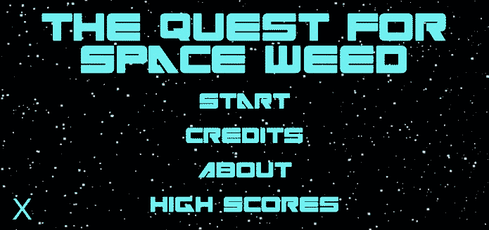
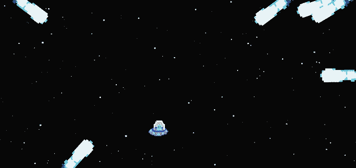
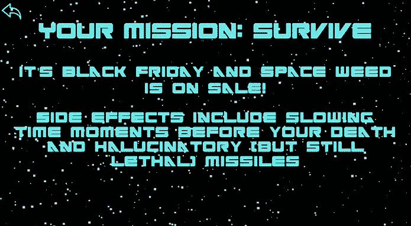
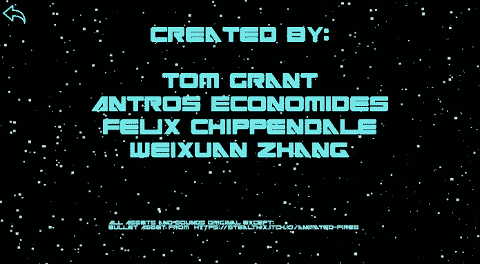

# The Quest for Space Weed

Our submission for the GameGig-2019 Hackathon

## Inspiration
We were inspired by various bullet hells, space invaders, and Superhot. The general concept was for time to freeze giving the player a limited amount of time to see all the bullets at the edge of the screen and predict their trajectories. In this time, they should try to move to a safe space before all projectiles simultaneously rocket across the screen as the countdown reaches 0.

## Collaboration

We collaborated using Unity hub, dividing up the work into different areas and each doing what we could to contribute.

We're very happy with how the game turned out, it's pretty fun and the music isn't half bad.

## Lore

You (the alien) have smoked discount space weed, which altered your perception of reality, warping time itself. Your mission: survive. Don't do drugs, kids.
